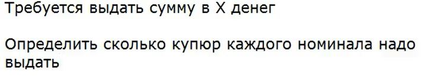

*описание домашних заданий*

**1 lesson:**

*заменить алгоритм в функции calculate на вычисление остатка от деления*

**2 lesson**

*нахождение введенных координат относительно круга, нарисованного в центре координат радиусом 1,
разделенного на части параболой, прямой, и системой координат*

**3 lesson*

*задача банкомат:**

*доработать программу, чтобы пользователь мог снимать деньги, пока не закончатся деньги в банкомате, или он не введет -1*