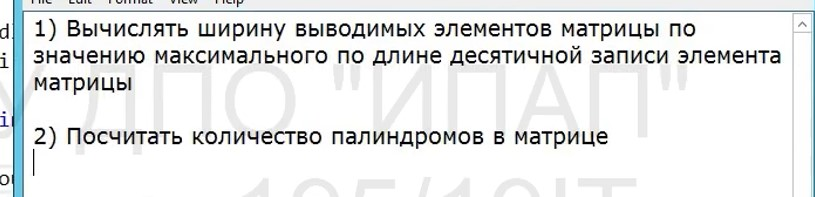

*описание домашних заданий*

**1 lesson:**

*заменить алгоритм в функции calculate на вычисление остатка от деления*

**2 lesson**

*нахождение введенных координат относительно круга, нарисованного в центре координат радиусом 1,
разделенного на части параболой, прямой, и системой координат*

**3 lesson*

*задача банкомат:**

*доработать программу, чтобы пользователь мог снимать деньги, пока не закончатся деньги в банкомате, или он не введет -1*

*создать вресию банкомата, в котором массивы номиналов и количество купюр каждого номинала заданы глобально, оформить выдачу требуемой суммы в виде функции, которая принимает один аргумент (требуемую сумму), использовать для вычисления глобально видимые массивы и просто выводит на экран массив выдаваемых купюр. В качестве рещультат либо ничего либо да-нет, либо целочисленный результат*

*6 lesson*
*почитать*

*8 lesson*
*написать алгоритм вычисления площади фигуры*

*11 lesson*

3) *отсортировать матрицу по порядку*

**12 lesson**
*сортировка матрица по схеме ниже*

